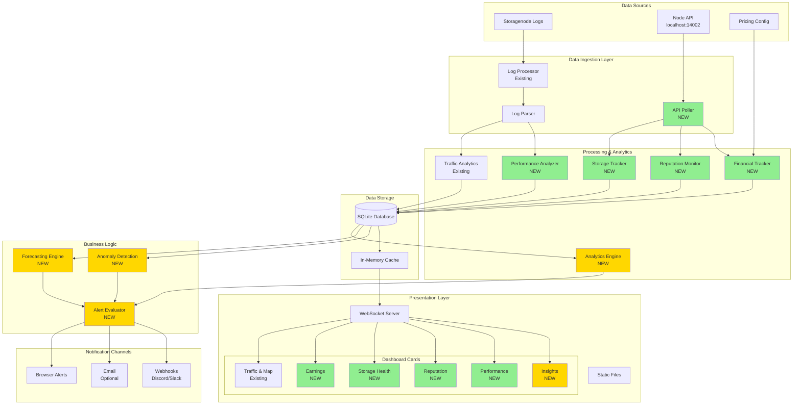
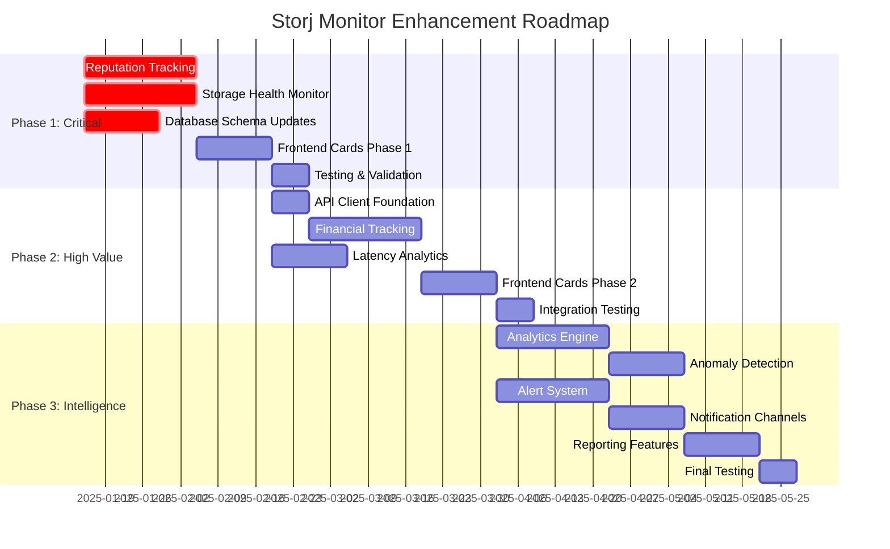
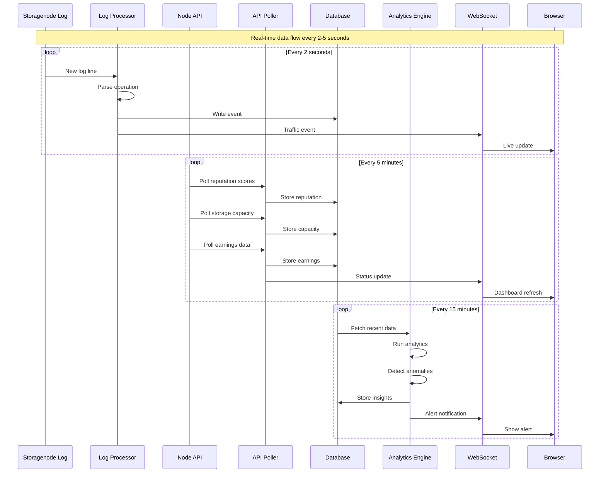
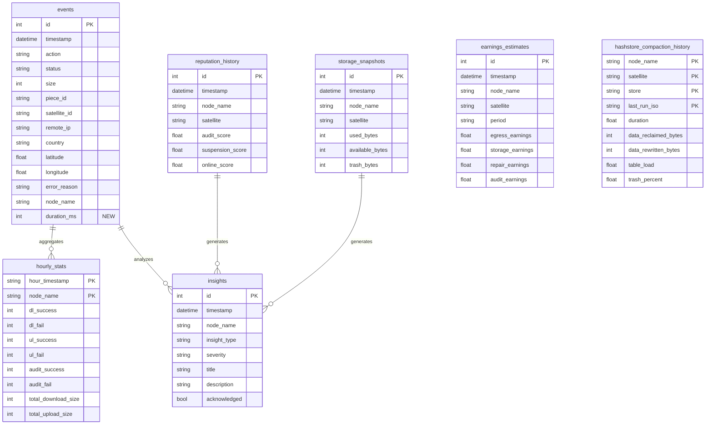
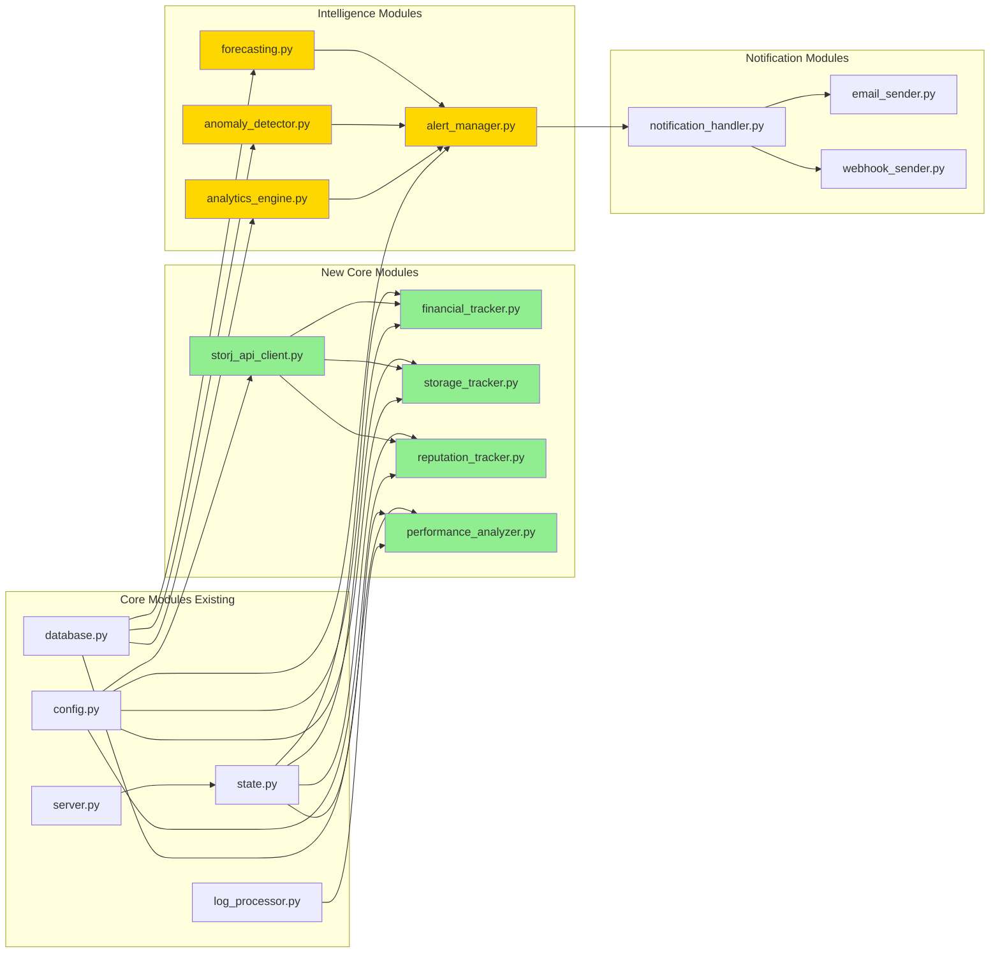

# Storj Node Monitor - Enhanced Architecture Diagram

## System Overview



**Legend:**
- 🟩 Green: Phase 1-2 (High Priority)
- 🟨 Yellow: Phase 3 (Intelligence Layer)
- ⬜ White: Existing Components

---

## Implementation Phases - Gantt Chart



---

## Data Flow Diagram - Real-Time Monitoring



---

## Database Schema - Enhanced ERD



---

## Module Architecture



---

## Alert Flow Decision Tree

```mermaid
graph TD
    START[New Data Point] --> CHECK{Check Type}
    
    CHECK -->|Reputation| REP[Reputation Score]
    CHECK -->|Storage| STOR[Storage Usage]
    CHECK -->|Performance| PERF[Operation Latency]
    CHECK -->|Earnings| EARN[Earnings Rate]
    CHECK -->|Anomaly| ANOM[Statistical Anomaly]
    
    REP --> REP_CHECK{Score < Threshold?}
    REP_CHECK -->|Yes| REP_SEV{Severity}
    REP_CHECK -->|No| OK[✓ Normal]
    
    REP_SEV -->|Critical| ALERT_CRIT[🔴 Critical Alert]
    REP_SEV -->|Warning| ALERT_WARN[🟡 Warning Alert]
    
    STOR --> STOR_CHECK{Usage > Threshold?}
    STOR_CHECK -->|Yes| STOR_FORECAST{Days Until Full}
    STOR_CHECK -->|No| OK
    
    STOR_FORECAST -->|< 7 days| ALERT_CRIT
    STOR_FORECAST -->|< 30 days| ALERT_WARN
    STOR_FORECAST -->|> 30 days| ALERT_INFO[🔵 Info Alert]
    
    PERF --> PERF_CHECK{Latency > Threshold?}
    PERF_CHECK -->|Yes| PERF_DUR{Duration}
    PERF_CHECK -->|No| OK
    
    PERF_DUR -->|> 10s| ALERT_CRIT
    PERF_DUR -->|> 5s| ALERT_WARN
    
    EARN --> EARN_CHECK{Rate Dropping?}
    EARN_CHECK -->|> 30%| ALERT_WARN
    EARN_CHECK -->|> 50%| ALERT_CRIT
    EARN_CHECK -->|No| OK
    
    ANOM --> ANOM_CHECK{Z-score > 3?}
    ANOM_CHECK -->|Yes| ALERT_INFO
    ANOM_CHECK -->|No| OK
    
    ALERT_CRIT --> NOTIFY_ALL[Notify All Channels]
    ALERT_WARN --> NOTIFY_PRIMARY[Notify Browser + Email]
    ALERT_INFO --> NOTIFY_BROWSER[Notify Browser Only]
    
    OK --> LOG[Log to Database]
    
    NOTIFY_ALL --> RECORD[Record Alert]
    NOTIFY_PRIMARY --> RECORD
    NOTIFY_BROWSER --> RECORD
    
    RECORD --> END[End]
    LOG --> END
    
    style ALERT_CRIT fill:#ff6b6b
    style ALERT_WARN fill:#ffd93d
    style ALERT_INFO fill:#6bcfff
    style OK fill:#51cf66
```



---

## Frontend Component Hierarchy

```mermaid
graph TD
    ROOT[App Root] --> HEADER[Header Card]
    ROOT --> CONTAINER[Main Container]
    
    HEADER --> NODE_SEL[Node Selector]
    HEADER --> OPTIONS[Display Options]
    HEADER --> ALERTS_ICON[🔔 Alerts Badge NEW]
    
    CONTAINER --> EXISTING[Existing Cards]
    CONTAINER --> NEW[New Cards]
    
    EXISTING --> MAP[Traffic Heatmap]
    EXISTING --> STATS[Success Rates]
    EXISTING --> HEALTH[Node Health]
    EXISTING --> PERF_CHART[Performance Chart]
    EXISTING --> SAT_CHART[Satellite Chart]
    EXISTING --> ANALYSIS[Error Analysis]
    EXISTING --> SIZE_CHART[Size Distribution]
    EXISTING --> COMPACTION[Active Compactions]
    EXISTING --> HASHSTORE[Hashstore Details]
    
    NEW --> EARNINGS[💰 Earnings Card]
    NEW --> STORAGE_HEALTH[📊 Storage Health]
    NEW --> REPUTATION[🎯 Reputation Card]
    NEW --> LATENCY[⚡ Latency Card]
    NEW --> INSIGHTS[🔮 Insights Card]
    NEW --> ALERTS_PANEL[🚨 Alerts Panel]
    
    EARNINGS --> EARN_CURRENT[Current Month]
    EARNINGS --> EARN_CHART[Earnings Trend]
    EARNINGS --> EARN_SAT[Per Satellite]
    
    STORAGE_HEALTH --> STOR_CAPACITY[Capacity Gauge]
    STORAGE_HEALTH --> STOR_FORECAST[Growth Forecast]
    STORAGE_HEALTH --> STOR_CHART[Usage Timeline]
    
    REPUTATION --> REP_SCORES[Score Dashboard]
    REPUTATION --> REP_TRENDS[Trend Indicators]
    REPUTATION --> REP_ALERTS[Risk Warnings]
    
    LATENCY --> LAT_METRICS[P50/P95/P99]
    LATENCY --> LAT_HISTOGRAM[Distribution]
    LATENCY --> LAT_SLOW[Slow Operations]
    
    INSIGHTS --> INS_ANOMALIES[Detected Anomalies]
    INSIGHTS --> INS_RECOMMENDATIONS[Smart Recommendations]
    INSIGHTS --> INS_PREDICTIONS[Forecasts]
    
    ALERTS_PANEL --> ALERT_ACTIVE[Active Alerts]
    ALERTS_PANEL --> ALERT_HISTORY[Alert History]
    ALERTS_PANEL --> ALERT_CONFIG[Alert Settings]
    
    style NEW fill:#90EE90
    style EARNINGS fill:#90EE90
    style STORAGE_HEALTH fill:#90EE90
    style REPUTATION fill:#90EE90
    style LATENCY fill:#90EE90
    style INSIGHTS fill:#FFD700
    style ALERTS_PANEL fill:#FFD700
    style ALERTS_ICON fill:#ff6b6b
```



---

## Quick Reference - Implementation Checklist

### Phase 1: Critical Foundation (Weeks 1-6)

#### Backend Tasks
- [ ] Create [`storj_api_client.py`](storj_api_client.py)
  - [ ] Implement API endpoint wrapper
  - [ ] Add connection retry logic
  - [ ] Create polling scheduler
- [ ] Create [`storage_tracker.py`](storage_tracker.py)
  - [ ] Poll capacity data every 5 minutes
  - [ ] Calculate growth rate
  - [ ] Implement forecasting algorithm
- [ ] Create [`reputation_tracker.py`](reputation_tracker.py)
  - [ ] Poll reputation scores every 5 minutes
  - [ ] Track score history
  - [ ] Implement alert thresholds
- [ ] Database schema updates
  - [ ] Add `storage_snapshots` table
  - [ ] Add `reputation_history` table
  - [ ] Add `duration_ms` column to events
- [ ] Testing
  - [ ] Unit tests for new modules
  - [ ] Integration tests with real node API
  - [ ] Performance validation

#### Frontend Tasks
- [ ] Create [`StorageHealthCard.js`](StorageHealthCard.js)
  - [ ] Capacity gauge visualization
  - [ ] Growth trend chart
  - [ ] Alert indicators
- [ ] Create [`ReputationCard.js`](ReputationCard.js)
  - [ ] Score display per satellite
  - [ ] Trend indicators
  - [ ] Risk warnings
- [ ] Update WebSocket handlers
  - [ ] Handle new message types
  - [ ] Update state management
- [ ] Styling and responsive design

### Phase 2: High Value Features (Weeks 7-14)

#### Backend Tasks
- [ ] Create [`financial_tracker.py`](financial_tracker.py)
  - [ ] Implement earnings calculations
  - [ ] Create pricing configuration
  - [ ] Historical earnings tracking
- [ ] Create [`performance_analyzer.py`](performance_analyzer.py)
  - [ ] Calculate latency percentiles
  - [ ] Detect slow operations
  - [ ] Performance trending
- [ ] Database updates
  - [ ] Add `earnings_estimates` table
  - [ ] Optimize query performance
- [ ] Testing

#### Frontend Tasks
- [ ] Create [`EarningsCard.js`](EarningsCard.js)
  - [ ] Current month display
  - [ ] Historical chart
  - [ ] Per-satellite breakdown
- [ ] Create [`LatencyCard.js`](LatencyCard.js)
  - [ ] Percentile metrics
  - [ ] Histogram visualization
  - [ ] Slow operation list
- [ ] Performance optimizations

### Phase 3: Intelligence Layer (Weeks 15-20)

#### Backend Tasks
- [ ] Create [`analytics_engine.py`](analytics_engine.py)
  - [ ] Statistical analysis algorithms
  - [ ] Pattern recognition
  - [ ] Trend analysis
- [ ] Create [`anomaly_detector.py`](anomaly_detector.py)
  - [ ] Z-score calculations
  - [ ] Baseline establishment
  - [ ] Anomaly classification
- [ ] Create [`alert_manager.py`](alert_manager.py)
  - [ ] Alert evaluation logic
  - [ ] Severity classification
  - [ ] Alert deduplication
- [ ] Create [`notification_handler.py`](notification_handler.py)
  - [ ] Email integration
  - [ ] Webhook integration
  - [ ] Notification routing
- [ ] Database updates
  - [ ] Add `insights` table
  - [ ] Alert history tracking
- [ ] Comprehensive testing

#### Frontend Tasks
- [ ] Create [`InsightsCard.js`](InsightsCard.js)
  - [ ] Anomaly display
  - [ ] Recommendations
  - [ ] Forecasts
- [ ] Create [`AlertsPanel.js`](AlertsPanel.js)
  - [ ] Active alerts list
  - [ ] Alert history
  - [ ] Alert configuration UI
- [ ] Browser notification integration
- [ ] Final polish and optimization

---

## Configuration Example

```python
# config.py - Example new configuration

# Node API Configuration
NODE_API_URL = "http://localhost:14002"
NODE_API_TIMEOUT = 10  # seconds
NODE_API_POLL_INTERVAL = 300  # 5 minutes

# Storage Alert Thresholds
STORAGE_WARNING_PERCENT = 80
STORAGE_CRITICAL_PERCENT = 95
STORAGE_FORECAST_DAYS = 30  # forecast window

# Reputation Alert Thresholds
AUDIT_SCORE_WARNING = 85.0
AUDIT_SCORE_CRITICAL = 70.0
SUSPENSION_SCORE_CRITICAL = 60.0
ONLINE_SCORE_WARNING = 95.0

# Performance Thresholds
LATENCY_WARNING_MS = 5000
LATENCY_CRITICAL_MS = 10000
SLOW_OPERATION_THRESHOLD = 3000  # ms

# Analytics Configuration
ENABLE_ANOMALY_DETECTION = True
ANOMALY_ZSCORE_THRESHOLD = 3.0
ANOMALY_BASELINE_DAYS = 7

# Notification Settings
ENABLE_BROWSER_NOTIFICATIONS = True
ENABLE_EMAIL_NOTIFICATIONS = False
ENABLE_WEBHOOK_NOTIFICATIONS = False

EMAIL_SMTP_SERVER = "smtp.gmail.com"
EMAIL_SMTP_PORT = 587
EMAIL_FROM = "alerts@storjmonitor.local"
EMAIL_TO = ["admin@example.com"]

WEBHOOK_URL = None  # Set to Discord/Slack webhook URL

# Pricing Configuration (Update when Storj changes rates)
PRICING_EGRESS_PER_TB = 7.00
PRICING_STORAGE_PER_TB_MONTH = 1.50
PRICING_REPAIR_PER_TB = 10.00
PRICING_AUDIT_PER_TB = 10.00

# Data Retention
STORAGE_SNAPSHOTS_RETENTION_DAYS = 90
REPUTATION_HISTORY_RETENTION_DAYS = 180
EARNINGS_HISTORY_RETENTION_DAYS = 730  # 2 years
INSIGHTS_RETENTION_DAYS = 90
```

---

**This architecture supports:**
- ✅ Horizontal scaling (multi-node monitoring)
- ✅ Real-time updates (WebSocket streaming)
- ✅ Historical analysis (SQLite persistence)
- ✅ Predictive insights (analytics engine)
- ✅ Proactive alerts (notification system)
- ✅ Modular extensibility (plugin architecture)

**Ready for implementation? Start with Phase 1! 🚀**