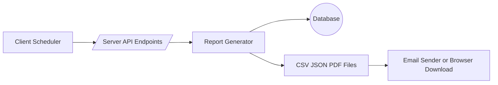

# Phase 10: Advanced Reporting and Export - Implementation Prompts

Priority: 🟡 MEDIUM
Duration: 1.5-2 weeks
Goal: Provide export APIs, on-demand PDF reports, optional scheduling, and CSV exports across events, earnings, reputation, storage, and alerts.

---

Overview

This guide directs implementation of reporting and export capabilities without disrupting existing monitoring, analytics, or notifications. It covers backend report generation, API endpoints, background scheduling, and minimal UI hooks.

Prerequisites
- Phases 1-9 complete
- Database migrations up to date
- Email notifications configured if scheduled delivery is enabled
- Adequate historical data for reports

---

Architecture and Data Flow



New Files
- storj_monitor/report_generator.py
- storj_monitor/scheduled_reports.py (optional; or extend tasks.py)

Modified Files
- storj_monitor/server.py
- storj_monitor/tasks.py
- storj_monitor/static/index.html
- storj_monitor/static/js/app.js

---

Step 1: Backend Report Generator

Create storj_monitor/report_generator.py providing reusable utilities to produce CSV and PDF outputs.

Report Types
- daily_summary: traffic and successes for last day, alerts, egress, key KPIs
- weekly_performance: 7-day performance trends, storage growth, reputation changes
- monthly_financial: complete earnings breakdown, payout forecast vs actual, ROI
- custom_range: user-specified start end and metrics

Recommended Interfaces

```python
# storj_monitor/report_generator.py
from dataclasses import dataclass
from typing import List, Dict, Any, Optional, Tuple, Iterable

@dataclass
class ReportParams:
    report_type: str              # daily_summary, weekly_performance, monthly_financial, custom_range
    start: Optional[str] = None   # ISO date
    end: Optional[str] = None     # ISO date
    node_names: Optional[List[str]] = None
    format: str = 'pdf'           # pdf csv json

def generate_report(params: ReportParams, db_path: str) -> Tuple[str, bytes]:
    """
    Return a tuple of mime_type, content_bytes for the requested report.
    For CSV, stream-friendly content can be produced by a generator in server.
    """

def generate_csv(params: ReportParams, db_path: str) -> Iterable[str]:
    """Yield CSV rows for streaming responses."""

def generate_pdf(params: ReportParams, db_path: str) -> bytes:
    """Return PDF bytes using ReportLab; minimal layout to start."""

# Helper query utilities use existing database accessors:
# - events by time range and node
# - earnings snapshots
# - reputation history
# - storage snapshots
# - alerts history if available
```

Data Retrieval Guidance
- Prefer existing read APIs in storj_monitor/database.py and storj_monitor/financial_tracker.py
- For large ranges, paginate database reads to keep memory bounded
- Normalize metrics per TB when useful
- Ensure time zone consistency UTC in backend; format local on frontend as needed

PDF Generation Notes
- Add reportlab dependency in pyproject.toml
- Start with text-only tables; chart embedding is optional
- Include report metadata: generated at, nodes included, time range
- Use simple table styles for clarity Dark mode not needed in PDFs

CSV Generation Notes
- First line as header
- Use ISO timestamps
- One row per time bucket or per entity depending on export
- Stream rows to client for large datasets

---

Step 2: API Endpoints

Implement export and reporting endpoints in storj_monitor/server.py. Use streaming responses for CSV to keep memory usage low.

Endpoints
- GET  /api/export/events?start=YYYY-MM-DD&end=YYYY-MM-DD&nodes=NodeA,NodeB&format=csv
- GET  /api/export/earnings?period=YYYY-MM&nodes=NodeA&format=csv
- GET  /api/export/reputation?days=30&node=NodeA&format=csv
- GET  /api/export/storage?days=30&node=NodeA&format=csv
- GET  /api/export/alerts?days=30&node=NodeA&format=csv
- POST /api/reports/generate   JSON body: {report_type, start, end, node_names, format}
- GET  /api/reports/list       Optional stub if scheduling implemented

Sample Handler Skeleton

```python
# storj_monitor/server.py
async def handle_export_events(request):
    params = parse_query_params(request)
    mime, content_iter_or_bytes = report_router('events', params, app['db_path'])
    return stream_or_bytes_response(mime, content_iter_or_bytes)

async def handle_generate_report(request):
    data = await request.json()
    params = ReportParams(**data)
    if params.format == 'csv':
        return stream_csv(generate_csv(params, request.app['db_path']))
    else:
        pdf = generate_pdf(params, request.app['db_path'])
        return web.Response(body=pdf, content_type='application/pdf')

def setup_reporting_routes(app):
    app.router.add_get('/api/export/events', handle_export_events)
    app.router.add_post('/api/reports/generate', handle_generate_report)
    # add other export endpoints similarly
```

Streaming Utility
- Implement a small generator to yield CSV lines and write to the aiohttp response using chunked transfer
- Set Content-Disposition with a safe filename including report type and date

---

Step 3: Scheduling Optional

Integrate minimal scheduled reports delivery using the existing background task loop in storj_monitor/tasks.py.

Scope
- Maintain a simple JSON schedule in config or database new table optional
- Support daily_summary and weekly_performance as v1
- Delivery channels: email via email_sender.py and optional webhook via webhook_sender.py attachments or links

Suggested Additions
- In tasks.py start a periodic coroutine every 60s to check due schedules
- When due, call generate_pdf then send via email
- Add exponential backoff retry and log failures via alert_manager.py

Persistence Options
- Option A: New database table scheduled_reports id, cron_like, recipients, report_type, params_json, enabled
- Option B: Config entry in config.py REPORT_SCHEDULES list of dicts for lightweight v1

Security
- Validate recipients domains if needed
- Do not expose schedule details over unauthenticated endpoints

---

Step 4: Minimal UI Hooks

Keep frontend work small in this phase. Add a Reports card with:
- Dropdown to choose report type and time range
- Generate PDF button calls POST /api/reports/generate
- CSV Export buttons link to GET endpoints with current node and time filters

Files to touch
- storj_monitor/static/index.html add Reports card near AlertsPanel
- storj_monitor/static/js/app.js add handlers to call endpoints and download files
- storj_monitor/static/js/charts.js no changes required

Accessibility
- Buttons with clear labels
- Loading state while generating PDFs
- Error banner on failure

---

Step 5: Testing Plan

Unit Tests
- test_report_generator_csv_rows covers headers and sample data formatting
- test_report_generator_pdf_smoke ensures non empty bytes and valid PDF header %PDF
- test_filename_sanitization ensures no path injection and safe names

Integration Tests
- test_export_events_endpoint streams CSV and validates first N rows
- test_generate_report_pdf returns application pdf and content length
- test_scheduled_report_dispatch uses fake schedule and captures email send calls

Performance Tests
- Large export 100k rows under 30s within memory bounds
- Concurrency two exports in parallel with acceptable latency

Target Coverage
- Reporting modules >80%
- Endpoints paths covered for happy and error cases

---

Step 6: Non Functional Requirements

Performance
- Stream CSV
- Paginate DB reads 5k rows per chunk

Reliability
- Retries with jitter for scheduled sending
- Graceful errors with JSON messages

Security
- Validate and clamp date ranges max 31 days per request
- Sanitize node names allowlist from configured nodes
- Content-Disposition with safe filenames

Observability
- Log start end and duration of report generation
- Emit alerts on repeated failures

---

Step 7: Acceptance Criteria

- CSV exports available for events, earnings, reputation, storage, alerts
- POST /api/reports/generate returns a downloadable PDF for daily_summary and monthly_financial
- Optional scheduling sends daily and weekly emails when enabled
- All tests passing with reporting coverage >80%
- Exports complete within 30s for 100k rows

---

Step 8: Prompts for Code Mode

Backend
1. Create storj_monitor/report_generator.py with ReportParams, generate_csv, generate_pdf, generate_report
2. Wire endpoints in storj_monitor/server.py and add setup_reporting_routes in app startup
3. Implement CSV streaming helper and safe filename utility
4. Add optional schedule checker in storj_monitor/tasks.py behind feature flag REPORT_SCHEDULING_ENABLED

Frontend
5. Add Reports card markup to storj_monitor/static/index.html with buttons
6. Add JS handlers in storj_monitor/static/js/app.js to call endpoints and trigger downloads

Tests
7. Add tests test_report_generator.py unit coverage
8. Add tests integration for endpoints and scheduling if enabled

Documentation
9. Update docs MASTER_ROADMAP.md and PROJECT_STATUS.md to mark Phase 10 in progress when started and complete when done

---

Ready to implement Phase 10. Follow the checklist above in order and keep changes backward compatible.