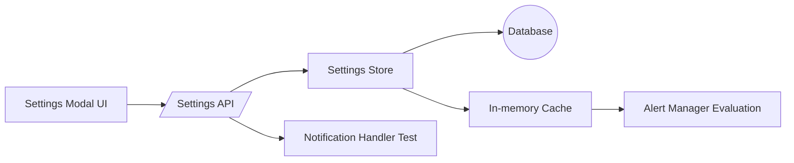

# Phase 11: Alert Configuration UI - Implementation Prompts

Priority: 🟡 MEDIUM
Duration: 1-1.5 weeks
Goal: Provide a user-facing configuration UI to customize alert thresholds, notification preferences, and advanced behaviors with per-node overrides and immediate effect on alert evaluation.

---

Overview

This guide covers a complete alert configuration workflow across frontend UI, backend settings storage, API endpoints, validation, persistence, and runtime application to alert evaluation.

Prerequisites
- Phases 1-9 complete
- Notifications operational (email, webhooks)
- Alert Manager integrated with analytics and monitors

---

Architecture and Data Flow



New Files
- storj_monitor/settings_store.py
- storj_monitor/static/js/SettingsModal.js
- storj_monitor/static/css/settings.css (optional consolidate into main)
- migration snippet or auto-migrate in storj_monitor/database.py

Modified Files
- storj_monitor/server.py
- storj_monitor/alert_manager.py
- storj_monitor/static/index.html
- storj_monitor/static/js/app.js
- storj_monitor/config.py (introduce defaults only; runtime values read from store)

---

Step 1: Settings Data Model and Persistence

Use a simple key-value store with scoped keys and optional per-node overrides. Prefer a normalized schema for clarity and future growth.

Database Schema (suggested)
- Table: settings
  - id INTEGER PRIMARY KEY
  - scope TEXT NOT NULL  # global or node:{node_name}
  - key TEXT NOT NULL
  - value TEXT NOT NULL   # JSON-encoded for complex structures
  - updated_at DATETIME DEFAULT CURRENT_TIMESTAMP
  - UNIQUE(scope, key)

- Table: settings_metadata (optional) for validation and UI hints
  - key TEXT PRIMARY KEY
  - type TEXT  # number, boolean, string, enum
  - min REAL
  - max REAL
  - options TEXT  # JSON list for enums
  - description TEXT

Auto-Migration
- On startup, ensure tables exist (idempotent)
- Populate default keys if absent using config defaults

Keys to Support (minimum)
- Thresholds
  - alert.audit_score.warning (float)
  - alert.audit_score.critical (float)
  - alert.suspension_score.critical (float)
  - alert.storage.usage.warning (float)  # fraction 0-1 or percent 0-100
  - alert.storage.usage.critical (float)
  - alert.performance.latency.warning_ms (int)
  - alert.performance.latency.critical_ms (int)
- Notifications
  - notify.email.enabled (bool)
  - notify.email.recipients (list of emails)
  - notify.webhook.enabled (bool)
  - notify.webhook.url (string)
  - notify.quiet_hours.enabled (bool)
  - notify.quiet_hours.start (string HH:MM)
  - notify.quiet_hours.end (string HH:MM)
  - notify.rate_limit.max_per_hour (int)
  - notify.route.severity (map: info/warning/critical -> channels)
- Advanced
  - alert.cooldown_minutes (int)
  - anomaly.sensitivity.zscore (float)
  - per_node_overrides.enabled (bool)

---

Step 2: Backend Settings Store

Create a small abstraction for get/set with caching and validation hooks.

Recommended Interfaces

```python
# storj_monitor/settings_store.py
from typing import Any, Dict, Optional, List, Tuple

class SettingsStore:
    def __init__(self, db_path: str):
        ...

    def get(self, key: str, node: Optional[str] = None) -> Any:
        """Fetch value, checking per-node first (node:{name}) then global."""

    def set(self, key: str, value: Any, node: Optional[str] = None) -> None:
        """Validate then upsert."""

    def get_all(self, scope: Optional[str] = None) -> Dict[str, Any]:
        """Return dict of key->value for scope or merged global view."""

    def validate(self, key: str, value: Any) -> Tuple[bool, Optional[str]]:
        """Type/range checks; return (ok, error)."""

    def load_cache(self) -> None:
        """Warm in-memory cache for fast reads; invalidate on writes."""

    def list_nodes(self) -> List[str]:
        """Return known nodes from database for per-node UI."""
```

Validation
- Enforce ranges for percentages and scores (0-100 or 0-1 consistently)
- Enforce email formats for recipients
- Enforce URL format for webhooks
- Coerce types: numbers, booleans, lists

Caching
- Simple dict cache keyed by (scope, key)
- Invalidate affected entries on set

---

Step 3: Settings API Endpoints

Add endpoints to retrieve, update, and test settings.

Endpoints
- GET  /api/settings  -> returns merged global settings and available nodes
- GET  /api/settings/node/{node_name} -> returns overrides for a node
- POST /api/settings  JSON body: {changes: [{key, value, node}...]}  -> bulk upsert with validation report
- POST /api/settings/test_notification  JSON body: {channel: "email"|"webhook"} -> sends test notification using current settings
- GET  /api/settings/metadata -> optional, serve validation metadata for UI hints

Behavior
- All writes validate; partial success returns per-key status
- Sensitive values (like webhook URLs) returned masked unless requested by admin flag (optional, local-only)

Integration points
- server.py: wire routes and handlers
- notification_handler.py/email_sender.py/webhook_sender.py: used by test_notification
- alert_manager.py: read thresholds via SettingsStore instead of config.py

---

Step 4: Frontend Settings Modal UI

Add modal HTML to index.html and implement logic in SettingsModal.js.

UI Requirements
- Trigger: gear icon button in header next to node selector
- Modal with tabs:
  - Thresholds: numeric inputs with units and validation
  - Notifications: toggles, recipients list, webhook URL
  - Advanced: cooldown, anomaly sensitivity, per-node overrides toggle
  - Per-Node Overrides: node dropdown, same fields enabling overrides
- Buttons: Save, Cancel, Test Notification
- Real-time validation feedback; disable Save on invalid

Minimal HTML insertion (in storj_monitor/static/index.html)
- Add a header button:
  - <button id="settings-open-btn" class="header-btn">⚙️ Settings</button>
- Add modal container near bottom before scripts:
  - <div id="settings-modal" class="modal-overlay" style="display:none">...</div>

Client Logic (storj_monitor/static/js/SettingsModal.js)
- initSettingsModal(): wire open/close, fetch settings on open
- render form controls from metadata or static schema
- on Save: POST /api/settings with changed keys only
- on Test: POST /api/settings/test_notification; show result banner
- apply input masks and validators; show units (%, ms) clearly

Styling
- Either add storj_monitor/static/css/settings.css or extend existing style.css with .modal-overlay, .modal-content, tabs, form controls, and responsive layout

Accessibility
- Focus trap inside modal
- Escape key closes
- Labels associated with inputs

---

Step 5: Apply Settings at Runtime

Alert Manager must pull thresholds from SettingsStore for each evaluation cycle.

Changes
- alert_manager.py: inject SettingsStore instance
- Read current thresholds at evaluation time or subscribe to cache invalidation
- Honor per-node overrides:
  - If override present for node X use override
  - Otherwise use global thresholds
- Respect quiet hours and rate limits in notification dispatch path
- Add a "preview" endpoint optional to show current effective thresholds per node

---

Step 6: Testing Plan

Unit Tests
- test_settings_store_validation: type/range enforcement
- test_settings_store_get_set_global_and_node
- test_settings_store_cache_invalidation
- test_settings_api_get_post_roundtrip
- test_test_notification_endpoint_mocks_senders

Integration Tests
- test_alert_manager_uses_settings_runtime: flip a threshold and verify evaluation outcome changes
- test_per_node_override_priority: node override beats global
- test_quiet_hours_suppresses_notifications

Security Tests
- test_sanitize_and_mask_sensitive_values
- test_reject_invalid_emails_and_urls

Target Coverage
- Settings store >90%
- API handlers >80%
- Alert manager integration paths covered

---

Step 7: Non-Functional Requirements

Performance
- Settings reads should be O(1) from cache
- API POST handles up to few hundred keys efficiently

Reliability
- All writes transactional
- Fallback to defaults if store unavailable; log warning

Observability
- Log settings changes (key-only, not sensitive values)
- Emit metric counters for test notifications and saves

---

Step 8: Acceptance Criteria

- Settings modal opens, displays current values, validates inputs
- Changes save and take effect immediately without restart
- Per-node overrides function and are visible in UI
- Test notifications deliver via selected channels
- Quiet hours and rate limits observed by notification handler
- All tests pass; coverage targets met

---

Prompts for Code Mode

Backend
1. Create storj_monitor/settings_store.py with get, set, get_all, validate, load_cache
2. Add database migrations for settings table in storj_monitor/database.py startup path
3. Wire API routes in storj_monitor/server.py for GET/POST settings and test_notification
4. Update storj_monitor/alert_manager.py to consume thresholds via SettingsStore

Frontend
5. Add modal markup to storj_monitor/static/index.html and a header button to open it
6. Implement storj_monitor/static/js/SettingsModal.js with tabs, fetch, save, and test actions
7. Extend storj_monitor/static/css/style.css for modal and form styles or add separate settings.css

Tests
8. Add unit tests for settings store and API
9. Add integration tests covering per-node overrides, runtime threshold application, and quiet hours

Documentation
10. Update ROADMAP and PROJECT_STATUS once Phase 11 begins and upon completion