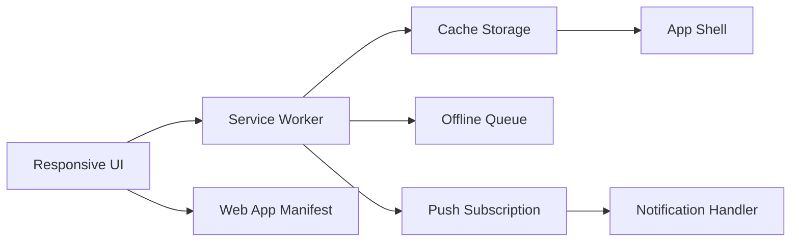

# Phase 12: Mobile Optimization and PWA - Implementation Prompts

Priority: 🟢 LOW-MEDIUM
Duration: 1.5-2 weeks
Goal: Deliver a responsive, mobile-friendly dashboard with installable PWA, offline support, and browser push notifications.

---

Overview

This guide directs implementation of mobile UX improvements, PWA capabilities, offline caching, and optional push notifications while preserving existing desktop behavior.

Prerequisites
- Phases 1-11 complete or non-conflicting
- HTTPS in production for service worker and push
- Icons available or generated in multiple sizes

---

Architecture and Data Flow



New Files
- storj_monitor/static/manifest.webmanifest
- storj_monitor/static/js/sw.js
- storj_monitor/static/js/push.js
- storj_monitor/static/icons/app-icon-192.png
- storj_monitor/static/icons/app-icon-512.png

Modified Files
- storj_monitor/static/index.html
- storj_monitor/static/css/style.css
- storj_monitor/static/js/app.js
- storj_monitor/server.py

---

Step 1: Responsive Layout and Touch Targets

Goals
- Mobile first layout with breakpoints for small screens
- Card stacking and grid adjustments
- Tables horizontally scrollable
- Touch targets minimum 44px

CSS Updates in style.css
- Add media queries at 1024px, 768px, 480px
- Convert fixed grids to auto-fit minmax
- Add .touch-target utility class with min-height 44px and padding
- Enable overflow auto on tables with .table-scroll

JS UX Tweaks
- Debounce resize events to reflow charts
- Use passive listeners for scroll and touch
- Add swipe gestures for node switching and panel toggles

Acceptance
- All core cards readable on 375x667 viewport
- Charts remain legible and responsive
- Lighthouse mobile score baseline 90

---

Step 2: PWA Manifest and Installability

Manifest at static/manifest.webmanifest
```json
{
  "name": "Storj Node Monitor",
  "short_name": "Storj Monitor",
  "start_url": "/",
  "display": "standalone",
  "background_color": "#0b1220",
  "theme_color": "#0ea5e9",
  "icons": [
    { "src": "/static/icons/app-icon-192.png", "sizes": "192x192", "type": "image/png" },
    { "src": "/static/icons/app-icon-512.png", "sizes": "512x512", "type": "image/png" }
  ]
}
```

index.html additions
- Link to manifest
- Meta theme color
- Apple meta tags for iOS install

app.js registration
- Register service worker sw.js on load if supported

Acceptance
- App installable on Chrome, Edge, Android
- Proper icons and splash on launch

---

Step 3: Service Worker and Offline App Shell

Strategy
- Cache first for app shell static assets
- Network first with fallback for live JSON over WebSocket not cached
- Stale while revalidate for API fetch endpoints when added in Phase 10

Precache list
- /static/index.html
- /static/css/style.css
- /static/js/app.js
- /static/js/charts.js
- /static/js/comparison.js
- /static/icons/* and manifest

sw.js responsibilities
- install event to precache
- activate to clean old caches
- fetch handler for GET requests to static and export endpoints
- background sync for offline queue optional

Server notes
- Ensure appropriate cache control headers for static assets

Acceptance
- App loads to functional shell when offline
- Cached CSS and JS refresh on next online visit

---

Step 4: Offline Data Layer

Goal
- Provide last known good metrics when offline

Approach
- Use IndexedDB to persist latest payloads per card
- Wrap WebSocket update handlers to write new snapshots
- On startup, if offline, load from IndexedDB and render

Files
- Extend app.js with idb helper functions

Acceptance
- When toggling airplane mode, UI still shows last data

---

Step 5: Push Notifications optional

Goal
- Deliver alerts via browser push when tab closed

Client
- push.js to request permission and subscribe using VAPID public key
- Send subscription to server endpoint

Server
- Add endpoint POST /api/push/subscribe to store subscription
- Integrate notification_handler to send web push for critical alerts

Dependencies
- pywebpush on server

Security
- Store only necessary fields
- Allow unsubscribe endpoint

Acceptance
- Test notification delivers while app closed

---

Step 6: Touch and Gesture Enhancements

- Swipe left right to switch nodes
- Pull to refresh on mobile
- Long press to open context menus on tables
- Pinch zoom on map where applicable

Acceptance
- No accidental scroll jank or blocking handlers

---

Step 7: Testing Plan

Responsive tests
- Viewports 360x640, 390x844, 768x1024

PWA tests
- Install prompt visible and working
- Service worker updates on reload after change
- Offline mode renders app shell and cached data

Push tests
- Subscription and unsubscription endpoints
- Delivery success under 5 seconds in local tests

Performance
- Lighthouse mobile score 90 or higher
- JS main thread tasks under 50ms budget for UI actions

---

Step 8: Non Functional Requirements

Performance
- Avoid heavy sync work on main thread
- Use requestIdleCallback for low priority caching

Reliability
- Graceful degradation if service worker unsupported
- Detect and recover from cache version mismatches

Security
- Serve over HTTPS
- Validate push origins and auth

Observability
- Log service worker lifecycle events to console in debug
- Count cache hits vs misses

---

Step 9: Acceptance Criteria

- Responsive layout passes manual checks on listed viewports
- PWA installable and launches standalone
- Offline support shows cached dashboard immediately
- Push notifications function when enabled
- Lighthouse mobile score at least 90
- All tests passing

---

Prompts for Code Mode

Backend
1. Add routes in [storj_monitor/server.py](storj_monitor/server.py) for push subscribe and unsubscribe
2. Wire notification dispatch to use web push for critical alerts
3. Serve [storj_monitor/static/manifest.webmanifest](storj_monitor/static/manifest.webmanifest) with correct content type

Frontend
4. Update header and layout in [storj_monitor/static/index.html](storj_monitor/static/index.html)
5. Add service worker registration in [storj_monitor/static/js/app.js](storj_monitor/static/js/app.js)
6. Implement [storj_monitor/static/js/sw.js](storj_monitor/static/js/sw.js) with precache and runtime caching
7. Add [storj_monitor/static/js/push.js](storj_monitor/static/js/push.js) subscription flow
8. Add responsive CSS in [storj_monitor/static/css/style.css](storj_monitor/static/css/style.css)

Data layer
9. Add IndexedDB helpers and offline snapshot load in [storj_monitor/static/js/app.js](storj_monitor/static/js/app.js)

Tests
10. Add integration tests for offline behavior and endpoints
11. Run Lighthouse and record scores in docs

Documentation
12. Update [docs/MASTER_ROADMAP.md](docs/MASTER_ROADMAP.md) and [docs/PROJECT_STATUS.md](docs/PROJECT_STATUS.md) when Phase 12 starts and completes

---

Ready to implement Phase 12. Follow steps in order and keep behavior backwards compatible on desktop.